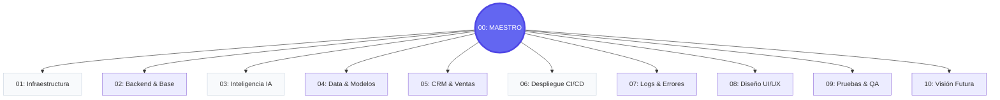

# 🦅 00: ÍNDICE MAESTRO DEL LIA ATLAS

### El Portal Central de la Inteligencia de LIA Educación

Este **Atlas** es la brújula técnica y estratégica de nuestro ecosistema. Ha sido diseñado para consolidar, en un único punto de verdad, toda la arquitectura de software, flujos de inteligencia artificial y procesos operativos del Dashboard LIA.

---

## 🎯 Objetivo de esta Documentación

El principal objetivo del **LIA Atlas** es proporcionar una visión de **fidelidad premium** sobre el sistema. Sirve como:

- **Manual de Navegación:** Para que nuevos desarrolladores y colaboradores entiendan el flujo completo en minutos.
- **Auditoría Técnica:** Para validar que cada componente (Base de datos, API, Agentes) cumple con los estándares de excelencia.
- **Hoja de Ruta:** Para planificar la escalabilidad y futuras integraciones del sistema.

---

## 🛰️ Funcionamiento General de la Plataforma (El Flujo Maestro)

Para entender LIA Educación, hay que visualizarla como un **organismo digital vivo** que transforma datos brutos en decisiones inteligentes. El proceso maestro es lineal y eficiente:

1. **Captación (Intake):** La información entra desde el mundo exterior (CRM HighLevel, Formularios o Webhooks).
2. **Procesamiento (El Motor):** El **Backend (02)** recibe el dato y despierta a los **Agentes IA (03)**. Estos analizan el contexto y deciden la mejor acción utilizando la **Memoria de Datos (04)**.
3. **Distribución (Output):** La decisión se envía de vuelta al CRM para automatizar ventas o se proyecta en el **Dashboard (08)** para que el equipo humano tome el control. Todo esto ocurre sobre una **Infraestructura (01)** blindada y siempre activa.

---

## 🏛️ Anatomía de las 10 Capas (Capas de Valor)

Para una navegación experta, cada módulo del Atlas representa un pilar vital del ecosistema:

### 🏗️ Las Bases (Fundamentos)

* **🌐 01: Infraestructura y Red (El "Terreno"):** Responde a **¿Dónde vive el sistema?**. Siteground, Railway, Docker y PostgreSQL. Es el suelo firme de LIA.
- **🚀 02: Arquitectura Backend (La "Máquina"):** Responde a **¿Cómo procesa el servidor?**. La lógica en Node.js, las rutas API y el middleware que hace que todo se mueva.

### 🧠 El Cerebro y la Memoria (Inteligencia)

* **🤖 03: Agentes IA (La "Inteligencia"):** Quién toma las decisiones. La orquestación de modelos (Gemini/OpenAI) y la lógica de prompts que da vida a LIA.
- **🗄️ 04: Diccionario de Datos (La "Memoria"):** Qué recuerda el sistema. El esquema Prisma y la estructura de tablas que guarda cada interacción.

### 🔌 Los Conectores y el Ciclo de Vida (Operación)

* **🤝 05: Integraciones GHL y CRM (Los "Puentes"):** Con quién habla LIA. La sincronización masiva con GoHighLevel y otros servicios externos.
- **🛡️ 06: Seguridad y CI/CD (El "Escudo"):** Cómo evoluciona y se protege. Automatización de despliegues y encriptación de variables críticas.

### 👁️ El Control y la Experiencia (UX/Ops)

* **🕵️ 07: Trazabilidad y Logs (La "Caja Negra"):** Qué ha pasado realmente. Auditoría de errores y monitoreo en tiempo real para evitar fallos.
- **🎨 08: Experiencia UI/UX (El "Rostro"):** Cómo interactúa el humano. Componentes maestros, diseño premium y la interfaz del Dashboard.

### 🚀 El Crecimiento (Evolución)

* **🧪 09: Guía QA y Playground (El "Laboratorio"):** Cómo probamos el futuro. Entornos de testeo y validación de nuevas funcionalidades.
- **📅 10: Roadmap Estratégico (La "Visión"):** Hacia dónde vamos. El plan de expansión y las próximas fronteras de LIA Educación.

---

## 🗺️ Mapa de Navegación (01 - 10)

---

## 📂 Directorio de Módulos (Acceso Premium)

| N° | Módulo | Preview / Resumen | Acceso Directo |
| :--- | :--- | :--- | :--- |
| **01** | **Infraestructura y Red** | Detalles de Docker, Railway y el flujo de red. | [Abrir Módulo](./01_INFRAESTRUCTURA_Y_RED.md) |
| **02** | **Arquitectura Backend** | Estructura del servidor Express y middleware de seguridad. | [Abrir Módulo](./02_ARQUITECTURA_BACKEND_Y_SEGURIDAD.md) |
| **03** | **Agentes IA** | Orquestación de modelos generativos y lógica de prompts. | [Abrir Módulo](./03_AGENTES_IA_Y_ORQUESTACION.md) |
| **04** | **Diccionario de Datos** | Diagramas Entidad-Relación y esquemas Prisma. | [Abrir Módulo](./04_DICCIONARIO_DATOS_Y_ER.md) |
| **05** | **Integraciones GHL** | Flujos de sincronización con CRM y Webhooks externos. | [Abrir Módulo](./05_INTEGRACIONES_GHL_Y_CRM.md) |
| **06** | **Seguridad y CI/CD** | Procesos de despliegue automático y encriptación de variables. | [Abrir Módulo](./06_SEGURIDAD_Y_CICLO_VIDA_CICD.md) |
| **07** | **Trazabilidad y Logs** | Monitoreo en tiempo real de errores y auditoría de eventos. | [Abrir Módulo](./07_TRAZABILIDAD_Y_LOGS_SISTEMA.md) |
| **08** | **Experiencia UI/UX** | Guía de estilos, componentes maestros y animaciones. | [Abrir Módulo](./08_EXPERIENCIA_USUARIO_UI_UX.md) |
| **09** | **Guía QA & Playground** | Entorno de pruebas y validación de casos de uso. | [Abrir Módulo](./09_GUIA_QA_Y_PLAYGROUND.md) |
| **10** | **Roadmap Estratégico** | Plan de crecimiento y nuevas funcionalidades LIA. | [Abrir Módulo](./10_ROADMAP_ESTRATEGICO.md) |

---

> [!IMPORTANT]
> **Modo de Consulta:** Esta documentación se actualiza en tiempo real con el desarrollo. Si detectas una inconsistencia, notifícalo a la Capa de Arquitectura.

---
*Edición Maestra v16.2 - LIA Educación Global Hub*
