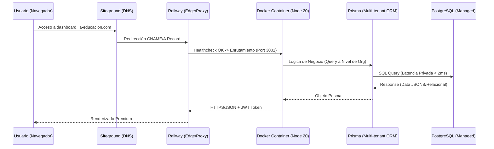

## 🏗️ 01: INFRAESTRUCTURA Y RED (El Terreno)

Este tomo documenta la base tecnológica sobre la cual reside el ecosistema de **LIA Educación**. Detalla cómo la infraestructura PaaS, la arquitectura de contenedores y la seguridad de datos se fusionan para crear un entorno de alta disponibilidad.

---

## 🗺️ Mapa de Interconexión Global

El viaje de un dato en el ecosistema LIA sigue este flujo: de la solicitud del usuario en el navegador hasta la persistencia en la base de datos distribuida.

---

## 🌐 Gestión de Dominios y Red (Siteground)

El dominio maestro `lia-educacion.com` reside en **Siteground**, actuando como el punto de entrada autoritativo del sistema.

- **Delegación DNS:** Los subdominios (dashboard, api) se apuntan mediante CNAME a los endpoints dinámicos de Railway.
- **SSL Termination:** Siteground maneja la entrada, pero delegamos la encriptación end-to-end a los certificados automáticos de Railway para simplificar la gestión de certificados en contenedores efímeros.

---

## 🚀 Orquestación y Edge Computing (Railway)

**Railway** actúa como el supervisor del sistema. No solo hospeda el código, sino que garantiza su vitalidad mediante políticas de orquestación avanzadas.

- **Healthchecks Inteligentes:** El sistema monitorea el endpoint `/api/health`. Railway espera hasta 120 segundos para confirmar que el contenedor está listo antes de dirigir tráfico.
- **Políticas de Resiliencia:** Configurado con `restartPolicyType = "ON_FAILURE"`. Si el backend experimenta un error crítico, el orquestador intenta hasta 3 reinicios automáticos inmediatos para restaurar el servicio.
- **Red Privada Interna:** La comunicación entre el Backend y PostgreSQL ocurre fuera del internet público, garantizando seguridad y una latencia mínima de red privada.

---

## 🐳 Arquitectura de Contenedores (Docker)

El backend de LIA utiliza una estrategia de **Multi-stage Build** optimizada para despliegues ligeros y seguros usando `Node 20 Alpine`.

### Fases de Construcción

1. **Etapa de Construcción (Builder):**
    - Instalación de dependencias completas.
    - Generación del **Prisma Client** (Traducción del esquema a código TypeScript).
    - Compilación (Transpilación) de TypeScript a JavaScript de alto rendimiento.
2. **Etapa de Producción (Final):**
    - Se descartan las herramientas de desarrollo y código fuente original.
    - Solo se copian los binarios compilados en `/dist` y las dependencias de ejecución.
    - El resultado es una imagen inmutable, ligera y resistente a vulnerabilidades.

---

## 💾 Persistencia y Multi-tenancy (Prisma + PostgreSQL)

LIA utiliza una arquitectura de **Base de Datos Única con Aislamiento Lógico** (Multi-tenant) gestionada mediante **Prisma ORM**.

- **Aislamiento por Organización:** Cada dato (Usuario, Curso, Lead) está vinculado a un `org_id` (Modelo `Organization`). Esto permite que múltiples institutos compartan la infraestructura sin que sus datos se mezclen.
- **Tipos de Datos Flexibles:** Uso intensivo de campos `JSONB` en PostgreSQL para almacenar configuraciones de marca (branding) y respuestas de IA sin sacrificar la velocidad de las consultas SQL tradicionales.
- **Migraciones Controladas:** Cada cambio en el esquema se gestiona con `prisma migrate`, asegurando que la base de datos de producción siempre sea un reflejo exacto del modelo lógico.

---

## 🔐 Gestión de Llaves de IA (Tokens del Cliente)

Para que el sistema sea modular, cada cliente puede integrar sus propios "cerebros". Las llaves de API se gestionan bajo un estricto protocolo de seguridad en el modelo `ApiKey`:

- **Soporte Multi-Proveedor:** El sistema está preparado para recibir y alternar entre `Gemini` y `OpenAI`.
- **Encriptación en Reposo:** Las llaves proporcionadas por el cliente se guardan encriptadas, vinculadas únicamente a su organización.
- **Uso Transparente:** Los agentes IA (`AiAgent`) consultan estas llaves dinámicamente al momento de realizar una inferencia, permitiendo que el cliente mantenga el control total sobre su consumo de IA.

---

## 🧪 Entorno de Demo y Pruebas

LIA incluye una organización maestra de ejemplo para facilitar el onboarding y el testing de QA.

- **Organización:** `Innovation Institute` (Slug: `innovation-institute`)
- **Administrador de Demo:**
  - **Email:** `admin@innovation-institute.edu`
  - **Password:** `admin123`
- **Contenido Pre-cargado:** La base de datos incluye cursos reales de IA, programas ejecutivos y equipos de venta pre-configurados para demostrar el flujo completo.

---

## 🔗 Navegación

- [Ir al Índice Maestro](./00_MASTER_INDEX.md)
- [Continuar a 02: Arquitectura Backend](./02_ARQUITECTURA_BACKEND_Y_SEGURIDAD.md)

---
*Documentación Técnica de Infraestructura v17.0 - Detalle Auditado de Docker/Railway/Demo*
