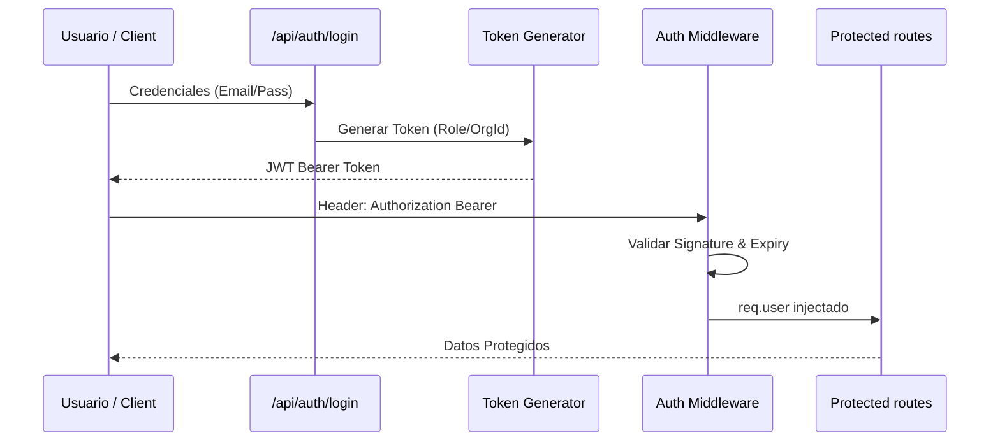

# 🏗️ Tomo 02: Arquitectura Backend y Seguridad de Acceso

Este tomo detalla la arquitectura de servicios y los mecanismos de protección de acceso que aseguran la plataforma **LIA Educación**.

---

## 🧩 Arquitectura de Seguridad JWT

---

## ⚙️ Principios Arquitectónicos

> [!TIP]
> **Autenticación Basada en Roles (RBAC)**: El sistema utiliza un middleware dual (`authenticate` y `authorize`) que no solo valida la identidad sino que restringe el acceso según los roles `admin`, `editor` o `viewer`.

### Componentes Clave

1. **JWT Utility**: Centraliza la firma y verificación de tokens usando `jsonwebtoken` y una `JWT_SECRET` robusta.
2. **Auth Middleware**: Intercepta todas las rutas bajo `/api/`, inyectando el payload del usuario (`userId`, `orgId`, `role`) en el objeto `Request` de Express.
3. **RBAC Logic**: Decoradores de ruta que permiten filtrar el acceso por roles específicos, garantizando el principio de mínimo privilegio.

---

## 🔗 Navegación

- [Ir al Índice Maestro](file:///Users/macbookair/Desktop/Antigratity-google/lia-educacion/dashboard/docs/LIA_ATLAS/PREMIUM/00_MASTER_INDEX.md)
- [Ir al Índice Maestro](file:///Users/macbookair/Desktop/Antigratity-google/lia-educacion/dashboard/docs/LIA_ATLAS/PREMIUM/00_MASTER_INDEX.md)

---
*LIA Atlas v15.4 - Arquitectura de Seguridad Sincronizada*
