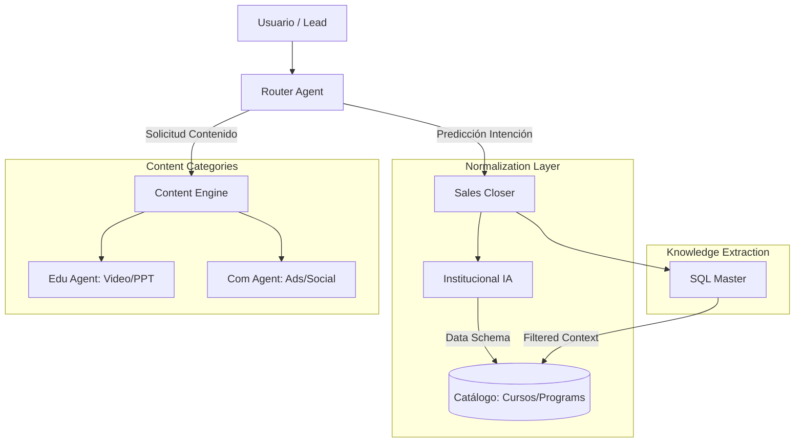
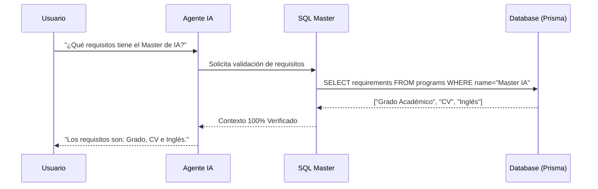

# 🤖 03: AGENTES IA Y ORQUESTACIÓN (Audit Hiper-Técnico)

Este tomo constituye la especificación técnica profunda de la **Capa de Inteligencia** de LIA Atlas. Aquí se desglosa el inventario exhaustivo de agentes, la lógica de orquestación multi-modelo y el roadmap de evolución hacia una arquitectura de agencia autónoma.

> [!IMPORTANT]
> **Seguridad y API Keys**: El sistema opera bajo un modelo de **Bring Your Own Key (BYOK)**. Las llaves de Gemini y OpenAI son proporcionadas por el cliente y se almacenan cifradas en la base de datos, garantizando aislamiento de datos y soberanía sobre el costo de inferencia.

---

## 🏗️ 1. Inventario Eestratégico de Agentes (Auditoría V2.0)

El ecosistema LIA se orquestará en 4 pilares fundamentales, permitiendo una especialización atómica y alta mantenibilidad.

### A. Ventas y Conversión (Sales Force)

| Agente | Objetivo Estratégico | Estado | Implementación |
| :--- | :--- | :--- | :--- |
| **Sales Closer** | Cierre de ventas consultiva y manejo de objeciones. | Activo | Implemented |
| **BDR Agent** | Clasificación inicial y nutrición de prospectos fríos. | Activo | Implemented |
| **Postulaciones IA** | Gestión del embudo de admisiones universitarias. | Inactivo | **Planned** |
| **Subscripciones IA** | Venta y retención de modelos de membresía recurrente. | Inactivo | **Planned** |

### B. Generación de Contenido (Content Engine)

#### 🎓 Educativo (LXP Support)

| Agente | Objetivo Estratégico | Estado | Implementación |
| :--- | :--- | :--- | :--- |
| **Video Analyzer** | Transcripción semántica y extracción de valor de clases. | Activo | Implemented |
| **PPT Synthesizer** | Conversión de estructuras de video a diapositivas. | Activo | Implemented |
| **Exam Builder** | Creación de evaluaciones adaptativas por módulo. | Activo | Implemented |

#### 📣 Comercial (Marketing Ops)

| Agente | Objetivo Estratégico | Estado | Implementación |
| :--- | :--- | :--- | :--- |
| **Ad Copywriter** | Generación de anuncios para Meta y Google Ads. | Activo | Implemented |
| **Sequence IA** | Orquestación de hilos de WhatsApp y email nurturing. | Activo | Implemented |
| **Landing Genius** | Arquitectura de copy para páginas de alta conversión. | Activo | Implemented |

### C. Inteligencia y Orquestación (LIA Brain)

| Agente | Objetivo Estratégico | Estado | Implementación |
| :--- | :--- | :--- | :--- |
| **Institucional IA** | **Meta-Agente**: Normalización de datos cross-category. | Inactivo | **Planned** |
| **SQL Master** | Generación dinámica de queries para Grounding real. | Activo | Implemented |
| **Router Agent** | Clasificación de intenciones y ruteo de prompts. | Activo | Implemented |

---

## 🔄 2. Orquestación e Interdependencia

LIA no utiliza un modelo único, sino una red de agentes que colaboran. El **Institucional IA** actúa como el núcleo de normalización que permite la interoperabilidad.

---

## 🧠 3. Mecanismos de Grounding (Anti-Alucinación)

Para garantizar la precisión de datos críticos (precios, fechas, requisitos), LIA implementa un flujo de **Grounding Estricto** mediante SQL dinámico.

---

## 🚀 4. Recomendaciones hacia la Agencia Autónoma

1. **Capa de Observabilidad**: Implementar **LangSmith** para auditar el "Chain of Thought" de cada agente.
2. **Inference Caching**: Guardar respuestas de consultas comunes a la DB para reducir latencia.
3. **Long-Term Memory**: Integrar una Vector DB (Pinecone/Supabase) para memoria persistente por usuario.
4. **Tool Calling Nativo**: Evolucionar de prompts planos a funciones estructuradas para ejecución de acciones.

> [!TIP]
> La arquitectura modular permite que nuevos agentes (ej. "Voice Agent") se integren simplemente añadiendo una nueva ruta al **Router Agent**.

---

## 🔗 Navegación

- [Regresar al Índice Maestro](./00_MASTER_INDEX.md)
- [Avanzar al Módulo 04: Diccionario de Datos](./04_DICCIONARIO_DATOS_Y_ER.md)

---
*LIA Atlas v21.0 - Refinamiento de Inteligencia Artificial*
