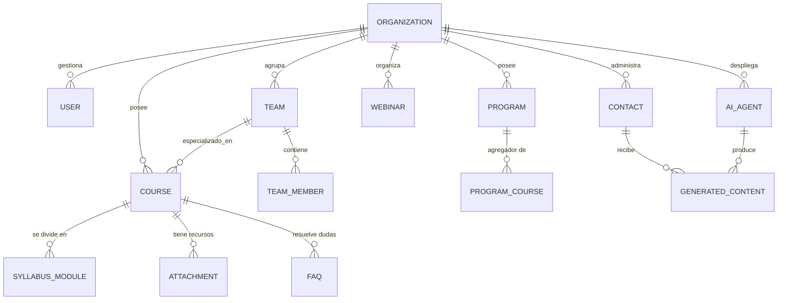
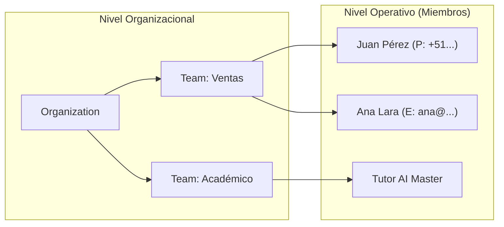

# 📊 04: DICCIONARIO DE DATOS Y MODELO ER (Manual Técnico V3.0)

Este documento es el nexo técnico entre el código (Prisma/PostgreSQL) y la visión estratégica de LIA Atlas. Aquí se detalla cada átomo de información, su origen, su flujo y las mejoras sugeridas para alcanzar la autonomía total de la IA.

---

## 🏗️ 1. Arquitectura de Interconectividad Total

El sistema LIA no es una base de datos estática; es un ecosistema vivo donde el dato se transforma desde una señal externa (GHL) hasta una acción autónoma (Sales Closer).

### 📐 1.1. Diagrama ER Maestro (Capa de Negocio)

---

## 📖 2. Auditoría Granular por Dominios

### 🎓 2.1. Dominio Académico (The Knowledge Base)

Este dominio alimenta el *Context Window* de los agentes. Cada campo está optimizado para ser "leído" por un LLM.

#### **Entidad: `Course` (Cursos Independientes)**

| Campo Técnico | Tipo | Propósito LIA Atlas | Status |
| :--- | :--- | :--- | :--- |
| `code` | String | ID Semántico para SQL Master (ej: `MKT-101`). | **Existente** |
| `title / subtitle` | String | Identificación pública y gancho comercial. | **Existente** |
| `ai_summary` | Text | **Crítico**: Versión ultra-resumida para RAG rápido. | **Existente** |
| `pain_points` | JSONB | Lista de problemas que el curso soluciona (Ventas). | **Existente** |
| `benefits` | JSONB | Promesas de valor para el Sales Closer. | **Existente** |
| `price / currency` | Decimal | Datos duros para el cierre de ventas. | **Existente** |
| `instructor_bio` | Text | Autoridad inyectada en el prompt de ventas. | **Existente** |

#### **Entidad: `Program` (Diplomados/Maestrías)**

Agrupa cursos bajo una certificación superior.

- **Campos Clave**: `total_duration`, `certifying_entity`, `requirements`.
- **Interconectividad**: Relación 1:N con `ProgramCourse` para mallas curriculares complejas.

#### **Entidad: `Webinar` (Eventos de Captación)**

| Campo | Tipo | Función |
| :--- | :--- | :--- |
| `speaker_title` | String | Define la autoridad del evento ante el lead. |
| `event_date / time`| DateTime | Gatilla recordatorios vía Agente de Seguimiento. |
| `call_to_action` | String | El objetivo final del evento (ej: "Inscribirse a Maestría"). |

---

### 👥 2.2. Dominio de Capital Humano (Teams & Members)

Este dominio permite que la IA sepa a qué humano escalar un caso cuando se supera el umbral de autonomía.

#### **Entidad: `Team` & `TeamMember`**

| Campo `TeamMember` | Propósito Atlas | Sugerencia Mejora |
| :--- | :--- | :--- |
| `name` | Identificación personal. | Ninguna. |
| `email / phone` | Canales de comunicación directa. | Validar formato internacional. |
| `role` | `sales | support | tutor`. | Dashboard de carga de trabajo. |
| `availability` | Horarios para agendamiento. | **Mejora**: Integrar con Cal.com/Calendly. |

---

### 💸 2.3. Dominio de Conversión (Sales & Postulaciones)

Este dominio aún reside parcialmente en lógica externa y requiere consolidación en la DB.

| Entidad Sugerida | Propósito | Campos Críticos | Status |
| :--- | :--- | :--- | :--- |
| **`Postulaciones`** | Gestión de aspirantes a becas. | `contact_id`, `ai_score`, `status_admision`. | **Roadmap** |
| **`Subscripciones`**| Control de pagos recurrentes. | `stripe_id`, `next_billing`, `plan_tier`. | **Roadmap** |
| **`Invoices`** | Registro contable de ventas. | `amount`, `tax_id`, `payment_method`. | **Roadmap** |

---

## 📉 3. Gap Analysis: Actual vs Premium Vision

| Categoría | Implementado en Prisma | Propuesta "LIA Premium" | Impacto |
| :--- | :--- | :--- | :--- |
| **Seguridad** | Roles básicos (Admin/Editor). | **RBAC Granular**: Permisos por curso. | Alta Seguridad. |
| **Sales Flow** | `Contact` con intereses. | **Opportunity Pipeline**: Tracking de etapas. | Mayor Conversión. |
| **AI Memory** | `ai_summary`. | **Knowledge Graph**: Conexiones entre temas. | Cero Alucinación. |
| **Branding** | Colores y Logo básicos. | **Theme Engine**: Fuentes, Sombras, Variants. | Experiencia Wah! |

---

## 🛠️ 4. Reglas de Integridad y Grounding (Hiper-Técnico)

### ⛓️ 4.1. El Nexo SQL Master

Para garantizar que un agente no alucine con el inventario, LIA Atlas implementa la **Triple Validación de Grounding**:

1. **Esquema**: El agente pregunta al `SQL Master` por el esquema de `Courses`.
2. **Consulta**: El `SQL Master` genera el Query (usando `orgId` obligatorio).
3. **Inyección**: Los resultados se pasan al prompt como "Hechos Verificados".

> [!IMPORTANT]
> **Índices Estratégicos**: Para mantener la velocidad en el Dashboard, toda tabla con escala > 10,000 registros debe tener el índice `@@index([orgId, createdAt])`.

---

## 🔗 Navegación

- [Regresar al Módulo 03: Agentes IA](./03_AGENTES_IA_Y_ORQUESTACION.md)
- [Avanzar al Módulo 05: Integraciones CRM](./05_INTEGRACIONES_GHL_Y_CRM.md)

---
*LIA Atlas v21.0 - Diccionario de Datos Hyper-Técnico V3*
