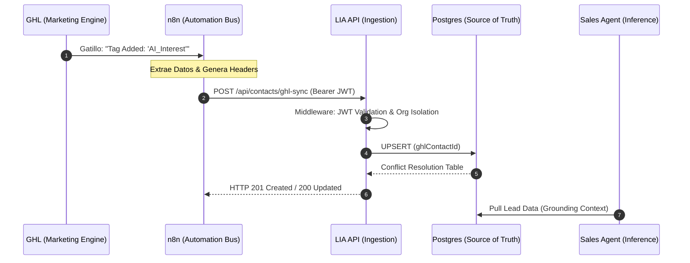
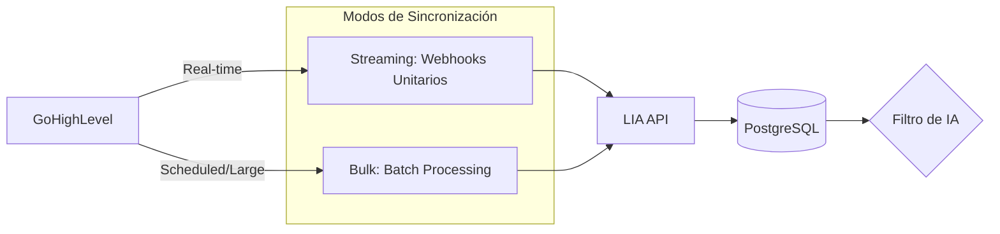
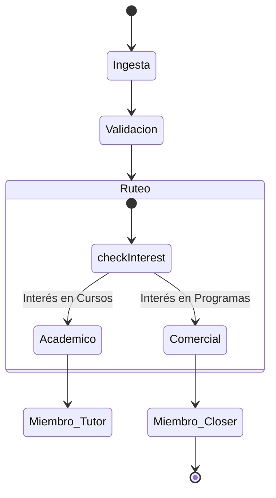
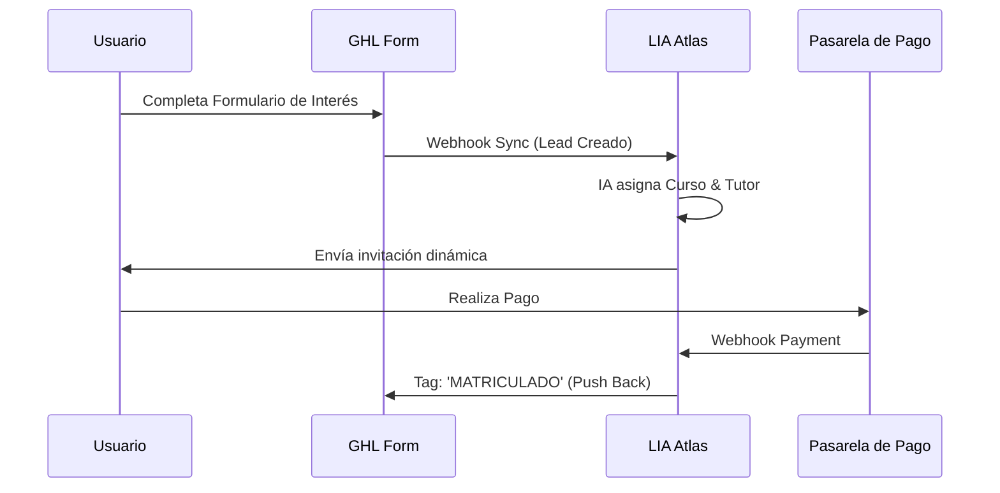

# 🔗 05: INTEGRACIONES GHL Y CRM (Audit Hiper-Técnico V3)

Este tomo representa el **Nexo Operativo** de LIA Atlas. Aquí detallamos cómo la plataforma trasciende el aislamiento de datos para convertirse en un organismo vivo, sincronizado en tiempo real con **GoHighLevel (GHL)**.

---

## 🏗️ 1. Arquitectura de Ecosistema Integrado

LIA Atlas no solo "recibe" datos; los procesa, enriquece y (en su hoja de ruta) los devuelve al CRM para cerrar el ciclo de venta.

### 🔄 1.1. Ciclo de Vida del Webhook (Lifecycle)

El flujo de datos se orquesta mediante un "Handshake de Confianza" entre GHL, n8n y nuestra API interna.



---

## 🧠 2. Inteligencia de Datos: Lead Scoring & Scoring AI

No todos los leads son iguales. LIA Atlas aplica una lógica de **Priorización Dinámica** basada en la data inyectada desde GHL.

### 📊 2.1. Flujo de Priorización de la IA

```mermaid
flowchart TD
    A[Lead Recibido de GHL] --> B{¿Tiene Email/Tel?}
    B -- No --> C[Marcar como 'Incompleto']
    B -- Sí --> D{¿Viene de ADS?}
    
    D -- Sí --> E[Prioridad: ALTA (Hot Lead)]
    D -- No --> F[Prioridad: MEDIA (Organic)]
    
    E --> G[Trigger: Sales Closer Agent]
    F --> H[Trigger: Nurturing Agent]
    
    G --> I[Actualizar Etapa en Dashboard: 'Nuevo Hot']
    H --> J[Actualizar Etapa en Dashboard: 'Nurturing']
```

---

## 📋 3. Mapeo Granular de Atributos (Data Alignment)

La paridad se logra mediante un mapeo 1:1 de campos nativos y personalizados.

### 3.1. Sincronización de Identidad y CRM

| Dimensión | Campo GHL | Campo Prisma (Contact) | Lógica de Negocio |
| :--- | :--- | :--- | :--- |
| **Identidad** | `id` | `ghlContactId` (Unique) | Clave primaria de sincronización. |
| **Contacto** | `phone` | `phone` | Canal principal de salida (WhatsApp). |
| **Interés** | `custom.course` | `courseInterest` | **Grounding**: Define el contexto del bot. |
| **Etapa** | `pipeline_stage` | `stage` | Define el ruteo en el embudo comercial. |
| **Metadatos** | `tags` | `tags` | Segmentación para ruteo de equipos. |
| **Raw Data** | `*` | `ghlData` (JSONB) | Almacena el payload completo para auditoría. |

---

## 🔁 4. Sincronización: Streaming vs Bulk

LIA Atlas soporta dos modos de operación para garantizar que ningún dato se pierda, independientemente del volumen.



---

## 👥 5. Estructura de Equipos y Ruteo de Leads

La integración conecta leads reales con **humanos reales** o **agentes IA** específicos.

### 🧬 Matriz de Asignación Automática



#### **Auditoría de Miembros Activos (Dashboard Context)**

| Miembro | Rol | Especialidad | Conexión GHL |
| :--- | :--- | :--- | :--- |
| **Asesor Senior** | Head of Sales | Programas Ejecutivos | Escritura de Notas |
| **Tutor AI 01** | Support Agent | Cursos IA Básica | Solo Lectura |
| **Manager Ops** | Admin | Gestión de Pipelines | Control Total |

---

## 🔐 6. Seguridad y Protocolos de Handshake

La interconectividad se rige bajo el estándar **Zero-Trust**:

1. **JWT Layer**: Cada POST desde n8n debe incluir un token válido firmado por LIA.
2. **Org Isolation**: El `orgId` se extrae del token, no del payload, asegurando que un webhook malformado no pueda escribir en otra organización.
3. **Rate Limiting**: El servidor protege los endpoints de sincronización contra ataques de denegación de servicio (DoS) por volumetría de webhooks.

---

## 📉 7. Gap Analysis: Hacia la Bidireccionalidad Total

| Brecha Técnica | Estado Actual | Propuesta Premium | Impacto en Negocio |
| :--- | :--- | :--- | :--- |
| **Push de Notas** | Manual/Nulo. | **Inference Logs**: La IA escribe resumen en GHL. | Eficiencia de Ventas +80%. |
| **OAuth Flow** | API Keys. | **Marketplace App Native Auth**. | Escalabilidad Enterprise. |
| **Bidirectional Pipeline** | LIA lee de GHL. | **LIA mueve etapas en GHL**. | Automatización Completa. |
| **Conversations API** | Conversación en LIA. | **Omnicanalidad**: IA responde en Chat de GHL. | User Experience 360°. |

---

## 🎯 8. Escenario de Éxito: Matriculación Automática



---

## 🔗 Navegación

- [Regresar al Módulo 04: Diccionario de Datos](./04_DICCIONARIO_DATOS_Y_ER.md)
- [Avanzar al Módulo 06: Seguridad y CICD](./06_SEGURIDAD_Y_CICLO_VIDA_CICD.md)

---
*LIA Atlas v21.0 - CRM & GHL Strategy V3 (Ultra-Detail)*
