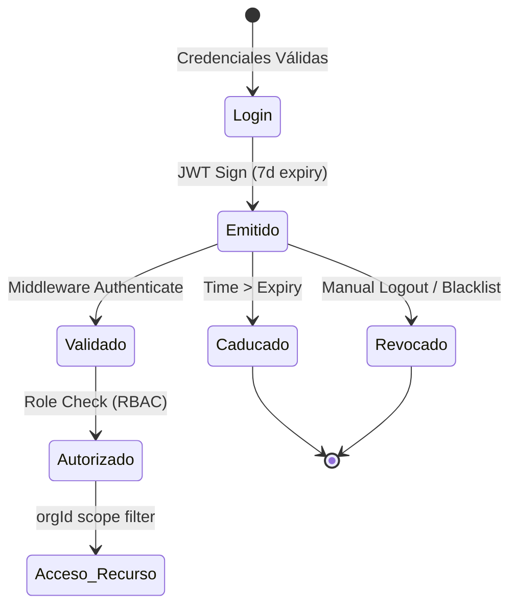
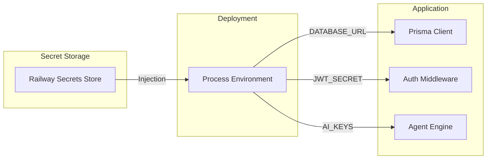
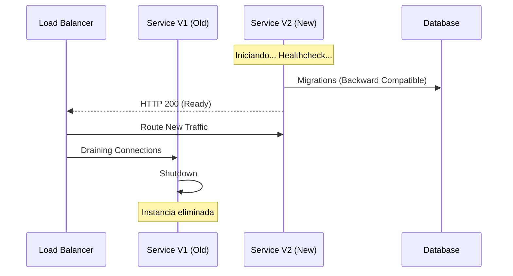

# 🛡️ 06: SEGURIDAD Y CICLO DE VIDA (Audit Hiper-Técnico V3)

Este tomo detalla la arquitectura de **Cyber-Resiliencia** y el motor de **DevSecOps** que sustenta LIA Atlas. Aquí la seguridad no es un parche, sino una propiedad intrínseca del código y la infraestructura.

---

## 🔐 1. Arquitectura de Seguridad Profunda (Defense in Depth)

LIA Atlas opera bajo el paradigma de **Confianza Cero (Zero Trust)**. Cada bit de datos está protegido por múltiples capas de validación.

### 🔑 1.1. Máquina de Estados del JWT (Token Lifecycle)

El ciclo de vida de un token está estrictamente orquestado para mitigar riesgos de secuestro de sesión y escalación de privilegios.



### 🧬 1.2. Matriz de Autorización RBAC (Role-Based Access Control)

El sistema impone un **Principio de Mínimo Privilegio (PoLP)** mediante middlewares de interceptación.

| Dimensión | Admin | Comercial | Tutor | Público |
| :--- | :---: | :---: | :---: | :---: |
| **Configuración Org** | ✅ | ❌ | ❌ | ❌ |
| **Gestión de Agentes** | ✅ | ⚠️ (Lectura) | ❌ | ❌ |
| **Sincronización GHL** | ✅ | ✅ | ❌ | ❌ |
| **Edición Académica** | ✅ | ❌ | ✅ | ❌ |
| **Visualización Lead** | ✅ | ✅ | ⚠️ (Limitado) | ❌ |

---

## 🏗️ 2. DevSecOps: Ciclo de Vida del Software

La integración de la seguridad en el pipeline de despliegue asegura que el código vulnerable nunca llegue a producción.

### 🚀 2.1. Pipeline de Despliegue de Alta Disponibilidad (Railway)

```mermaid
flowchart TD
    subgraph "Inner Loop (Dev)"
    A[Push Code] --> B[Lint & Type Check]
    B --> C[Unit Tests]
    end

    subgraph "Outer Loop (CI/CD Pipeline)"
    C --> D{Railway Trigger}
    D --> E[Multi-stage Docker Build]
    E --> F[Prisma Binary Generation]
    F --> G[Environment Injection]
    G --> H[Deployment Start]
    end

    subgraph "Verification (Post-Deploy)"
    H --> I{Healthcheck /api/health}
    I -- "Fail" --> J[Auto-Rollback]
    I -- "Pass" --> K[Atomic Link Switch (Zero Downtime)]
    end
```

---

## 📦 3. Hardening de Contenedores y Entorno

El despliegue utiliza **Contenedores Efímeros** e inmutables, minimizando la superficie de ataque.

### 🐧 3.1. Auditoría del Dockerfile (Hardening)

| Capa | Acción Técnica | Mitigación de Riesgo |
| :--- | :--- | :--- |
| **Alpine Linux** | Base `node:20-alpine`. | Elimina utilidades innecesarias (curl, wget, shells) reduciendo vectores de ataque. |
| **Multi-Stage** | Separación de `Builder` y `Runner`. | Los secretos de construcción y el código fuente no residen en la imagen final. |
| **Unprivileged** | Uso de `USER node` (Propuesto). | Evita que un escape de contenedor obtenga privilegios de `root` en el host. |
| **Read-Only FS** | Montaje de volúmenes específicos. | Impide que un atacante modifique el código ejecutable en tiempo de ejecución. |

---

## 🔑 4. Gestión de Secretos y Flujo de Variables

LIA Atlas nunca escribe secretos en el disco. El flujo de claves es **Volátil y Encriptado**.



---

## 📉 5. Gap Analysis: DevOps Actual vs Visión Ultra-Premium

| Brecha Técnica | Implementación Actual | Propuesta Premium | Impacto |
| :--- | :--- | :--- | :--- |
| **Secret Rotation** | Manual via Dashboard. | **Automated Rotation (Vault)**. | Crítico para cumplimiento SOC2. |
| **Scanning** | Nulo. | **Snyk / SonarQube**. | Detección de CVEs en tiempo real. |
| **VPC Infrastructure**| Public Endpoints. | **Private Networking (Railway VPC)**. | Eliminación de exposición pública de DB. |
| **Infrastructure as Code**| Manual/GUI. | **Terraform / Pulumi**. | Replicabilidad instantánea de entornos. |

---

## 🎯 6. Escenario de Despliegue: El "Atomic Switch"

Garantiza que el usuario nunca vea un error `502 Bad Gateway` durante una actualización.



---

## 🚀 7. Roadmap de Resiliencia y DevSecOps

1. **Hito 01**: Integración de **Datalogging** de auditoría: Quién, Cuándo y Qué (CRUD-level auditing).
2. **Hito 02**: Configuración de **WAF (Web Application Firewall)** avanzado para mitigación de ataques Layer 7.
3. **Hito 03**: Despliegue de **Canary Releases** para probar nuevas versiones en el 5% del tráfico antes del rollout total.

---

## 🔗 Navegación

- [Regresar al Módulo 05: Integraciones GHL](./05_INTEGRACIONES_GHL_Y_CRM.md)
- [Avanzar al Módulo 07: Trazabilidad y Logs](./07_TRAZABILIDAD_Y_LOGS_SISTEMA.md)

---
*LIA Atlas v21.0 - Security & CI/CD Strategy V3 (Ultra-Detail)*
