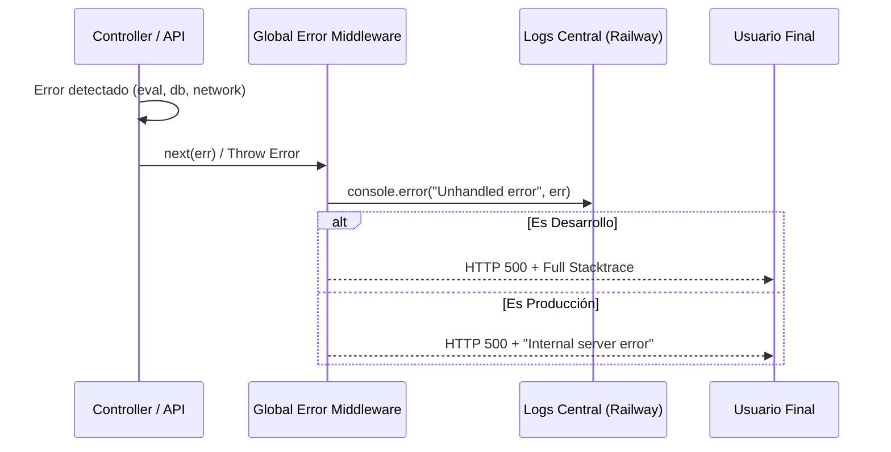
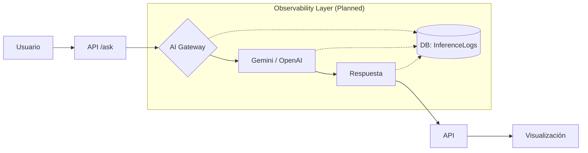
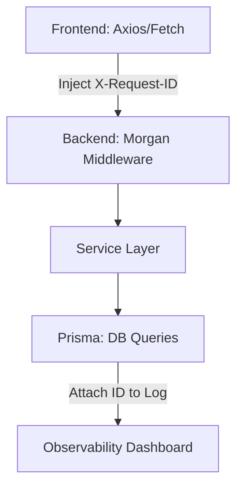

# 📊 07: TRAZABILIDAD Y LOGS (Audit Hiper-Técnico V3)

Este tomo analiza la capacidad de LIA Atlas para observar su propio estado, diagnosticar errores en tiempo real y auditar el uso de recursos de IA, garantizando que cada operación sea rastreable y facturable.

---

## 🔍 1. Arquitectura de Observabilidad Actual

LIA Atlas utiliza actualmente un modelo de **Logging Reactivo** basado en flujos de salida estándar (`stdout/stderr`).

### 🛠️ 1.1. Flujo de Propagación de Errores

Cada error que ocurre en los controladores es capturado y centralizado para evitar fugas de información sensible al cliente.

---

## 🤖 2. Observabilidad de IA (Traceability Gap)

Un punto crítico identificado en esta auditoría es la necesidad de un **Registro de Inferencias** detallado para optimizar costos y calidad.

### 📉 2.1. El Ciclo de Auditoría Propuesto (AI Logs)

Actualmente, las llamadas a Gemini/OpenAI no se persisten en la base de datos, lo que dificulta la auditoría de costos por organización.

| Métrica a Trazar | Estado | Propuesta |
| :--- | :--- | :--- |
| **Input Tokens** | No registrado. | Registro vía respuesta de API. |
| **Output Tokens** | No registrado. | Registro vía respuesta de API. |
| **Latencia (ms)** | No registrado. | `performance.now()` en el Proxy. |
| **Modelo Usado** | Consola. | Persistencia en `ghl_data` o tabla `Audit`. |

---

## 🔗 3. Trazabilidad de Peticiones (Request Tracing)

Para sistemas multi-tenant complejos, es vital rastrear una petición desde que sale del navegador hasta que toca la DB.

### 🛰️ 3.1. Implementación de X-Request-ID

---

## 🛡️ 4. Auditoría de Base de Datos (Event Sourcing)

Actualmente, si se elimina una organización o se cambia una API Key, no hay un rastro histórico ("Who changed what?").

### 📜 4.1. Propuesta de Auditoría Prisma

Integración de un middleware de Prisma para capturar eventos de escritura de alto impacto.

| Evento | Trazabilidad | Meta-data |
| :--- | :--- | :--- |
| **Delete Org** | Crítica. | `userId`, `timestamp`, `orgData_snapshot`. |
| **Upsert API Key** | Alta. | `provider`, `maskedKey`, `userId`. |
| **GHL Sync** | Media. | `contacts_count`, `duration`, `status`. |

---

## 📊 5. Gap Analysis: Logs Reactivos vs Observabilidad Proactiva

| Técnica | Estado | Impacto Premium |
| :--- | :--- | :--- |
| **Estructura** | Texto plano (Console). | **Structured JSON Logging**: Facilita búsquedas en ELK/Cloudwatch. |
| **Alertas** | Manual (Viendo Railway). | **Automated Alerts (Slack)**: Notificación instantánea de 500s. |
| **APM** | Nulo. | **OpenTelemetry**: Trazado completo de transacciones distribuidas. |
| **Cost Control** | Estimado. | **Real-time AI Budgeting**: Límites por `orgId` basados en logs. |

---

## 🚀 6. Roadmap de Trazabilidad Total

1. **Fase 1 (MVP)**: Implementar **Winston** para logs estructurados y capturar el `X-Request-ID` en todas las cabeceras.
2. **Fase 2 (AI Tracking)**: Crear la tabla `InferenceLog` para guardar Prompt, Response, Tokens y Costo por cada llamada a la IA.
3. **Fase 3 (Enterprise)**: Integrar **Sentry** o **New Relic** para monitoreo de errores en frontend y backend de manera unificada.

---

## 🔗 Navegación

- [Regresar al Módulo 06: Seguridad y CI/CD](./06_SEGURIDAD_Y_CICLO_VIDA_CICD.md)
- [Avanzar al Módulo 08: Experiencia de Usuario](./08_EXPERIENCIA_USUARIO_UI_UX.md)

---
*LIA Atlas v21.0 - Observability & Traceability Strategy V3*
