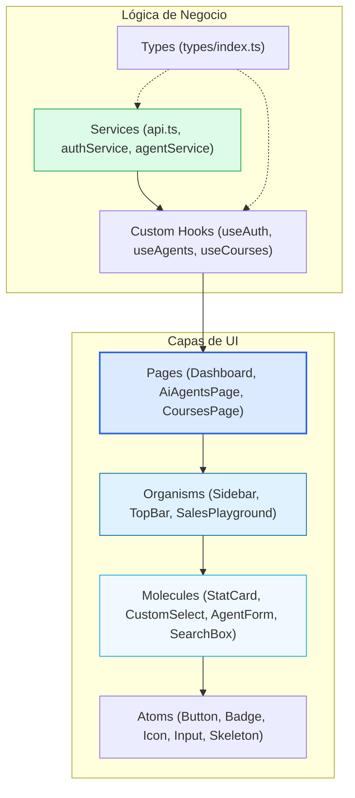
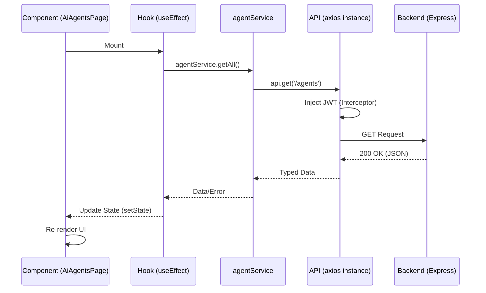
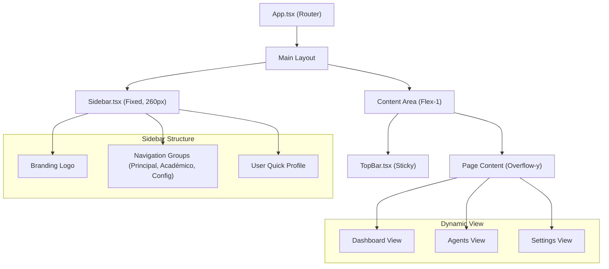
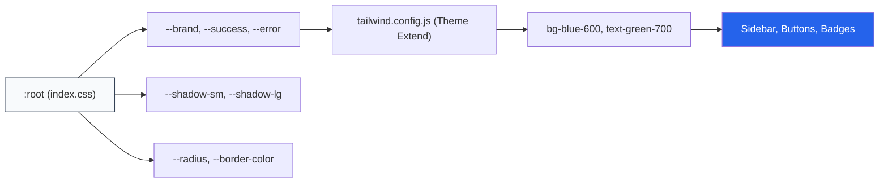
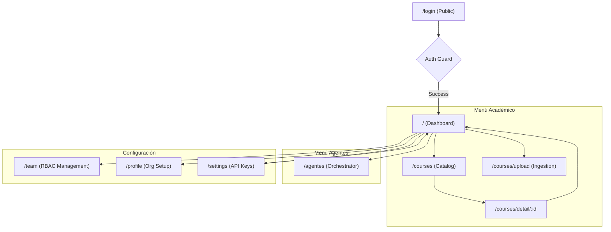

# 🎨 08: EXPERIENCIA DE USUARIO (UI/UX) - Audit V4 (Ultra-Detail)

### Capa de Experiencia y Frontend (¿Cómo se vive?)

LIA Atlas no es solo un dashboard; es un entorno de trabajo cognitivo. Esta versión V4 desglosa la arquitectura de componentes React, la orquestación de servicios asíncronos y el sistema de diseño basado en tokens industriales.

---

## 🏗️ Topología Atómica Expandida

La interfaz se descompone en capas de responsabilidad clara, permitiendo mantenibilidad y escalabilidad horizontal.

---

## 🔄 Orquestación de Servicios & Ciclo de Vida

El flujo de datos sigue un patrón unidireccional estricto, desde el interceptor de Axios hasta la renderización de los componentes.

---

## 🖼️ Jerarquía de Composición de Layout

LIA utiliza un sistema de rejilla asimétrica donde el Sidebar actúa como el ancla de navegación global.

---

## 💎 Design System & CSS Variable Tree

El sistema visual hereda valores de una raíz centralizada, permitiendo cambios de tema instantáneos.

---

## 📱 Estrategia de Responsividad & Breakpoints

La adaptación visual se gestiona mediante modificadores de Tailwind, optimizados para tabletas y móviles.

| Breakpoint | Dimensión | Rol en LIA Atlas | Ajuste Técnico |
| :--- | :--- | :--- | :--- |
| **sm** | `640px` | Móvil Vertical | Sidebar oculto, colapsado a Grid 1 col. |
| **md** | `768px` | Tablet | Sidebar con Hamburger, TopBar centralizado. |
| **lg** | `1024px` | Laptop Small | Sidebar fijo, transición de padding-left. |
| **xl** | `1280px` | Desktop | Grid 3-4 cols para StatCards y Tables. |

---

## 🗺️ Navigation Map (Sitemap Técnico)

---

## 🔍 Gap Analysis V4: UI/UX Maturity

| Característica | Estado Actual | Meta Enterprise V4 | Acción Técnica |
| :--- | :--- | :--- | :--- |
| **Data Visualization** | StatCards Estáticos | Interactive Charts (Recharts) | Implementar series de tiempo para KPIs. |
| **Feedback IA** | Loaders Simples | Streaming Text & AI Pulse Effects | Framer Motion para "Efecto Escritura". |
| **Layout** | Fixed Sidebar | Collapsible Sidebar (Mini-mode) | Expandir área de trabajo para DataTables. |
| **Error Handling** | Modales Simples | Contextual Toasts (Sonner) | Notificaciones no intrusivas. |

---

## 🚀 Roadmap de Evolución UX V4

1. **Orquestación de Animaciones**: Uso de `AnimatePresence` de Framer Motion para transiciones fluidas entre sub-rutas acadmémicas.
2. **Dashboard Inteligente**: Widgets dinámicos que se reordenan según el rol (Admin vs Editor).
3. **Sistema de Búsqueda Global**: `Cmd+K` interface con indexación local para acceso ultra-rápido a cursos y agentes.
4. **Dark Theme Native**: Implementación de `dark:` classes en todo el inventario de componentes.

---

## 🔗 Navegación Auditoría

- [Ir al Índice Maestro](file:///Users/macbookair/Desktop/Antigratity-google/lia-educacion/dashboard/docs/LIA_ATLAS/PREMIUM/00_MASTER_INDEX.md)
- [Regresar a 07: Trazabilidad y Logs](file:///Users/macbookair/Desktop/Antigratity-google/lia-educacion/dashboard/docs/LIA_ATLAS/PREMIUM/07_TRAZABILIDAD_Y_LOGS_SISTEMA.md)
- [Continuar a 09: QA y Playground](file:///Users/macbookair/Desktop/Antigratity-google/lia-educacion/dashboard/docs/LIA_ATLAS/PREMIUM/09_GUIA_QA_Y_PLAYGROUND.md)

---
*LIA Atlas v20.0 - Documentación Técnica UI/UX de Nivel Industrial (V4)*
