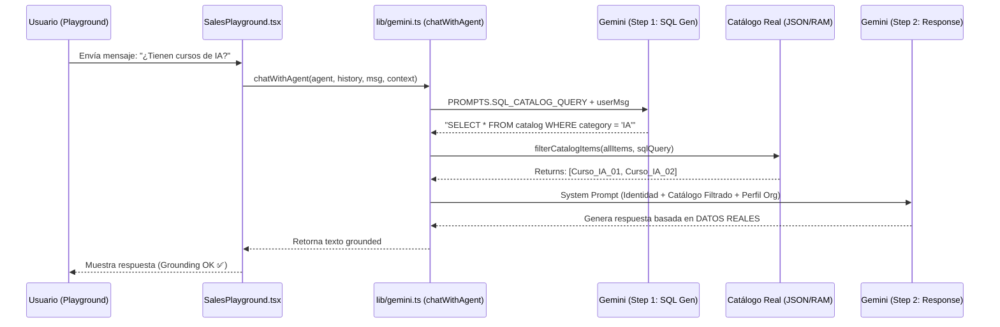
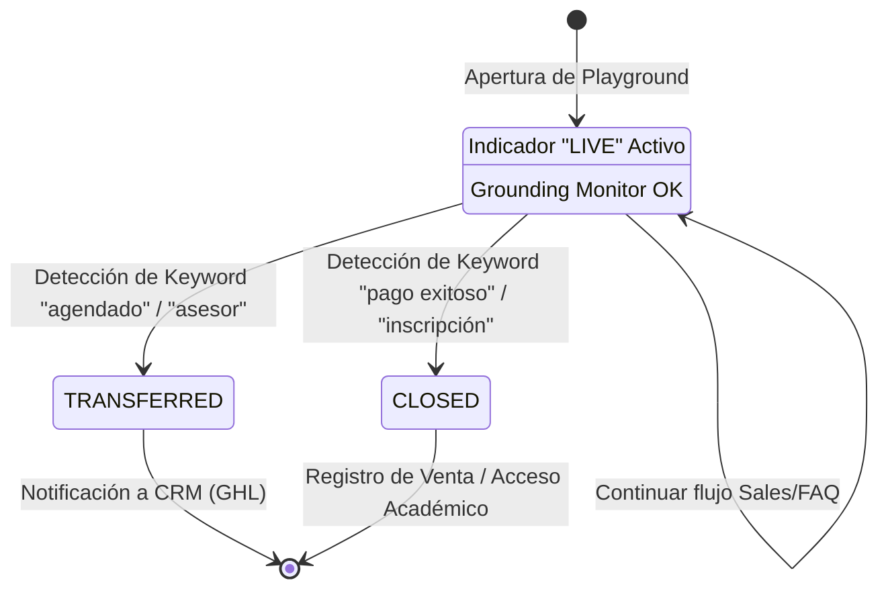
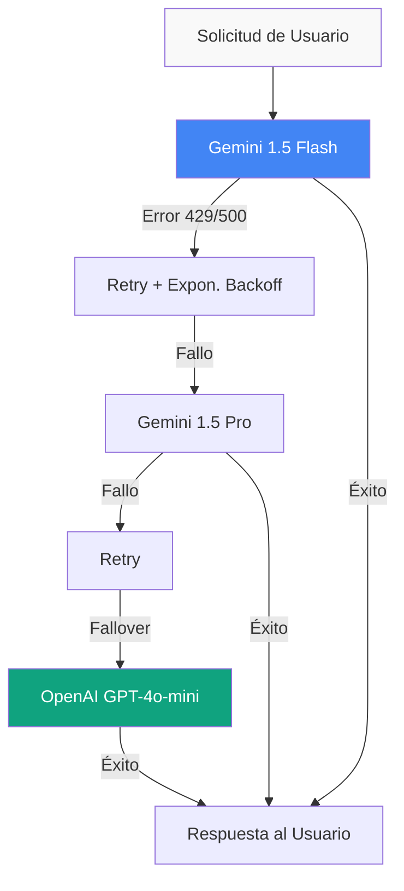
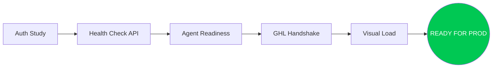

# 🧪 09: GUIA DE QA Y PLAYGROUND (ULTRA DETAIL V4)

## 🎯 Capa de Aseguramiento (Ground Truth)

El Playground de LIA no es solo un chat; es un motor de **Inferencia Grounded** que garantiza que los agentes no alucinen información comercial. Utiliza un ciclo de dos pasos para filtrar el catálogo real antes de generar cualquier respuesta.

---

## 🏗️ Ciclo de Inferencia y Grounding (Mermaid)

Este diagrama detalla cómo el sistema pre-procesa la consulta del usuario mediante una "Consulta SQL Simulada" para extraer el contexto exacto del catálogo.

---

## 🚦 Máquina de Estados de la Conversación

El sistema monitorea las respuestas de la IA para detectar disparadores (triggers) que cambian el estado del lead de "Interesado" a "Cerrado" o "Transferido".

---

## 🛡️ Cascada de Resiliencia (Multi-Model Failover)

LIA implementa una estrategia de "Zero Downtime" para la IA mediante un sistema de reintentos y cambio de proveedor en caliente.

---

## 📋 Protocolos de QA Técnico

### 1. Validación de Inyección de Contexto (Grounding)

- **Check**: El agente no debe mencionar precios o cursos que no existan en el `SalesPlayground` Indicator.
- **Protocolo**: Enviar "¿Tienen cursos de Cocina?" cuando el catálogo solo tiene "IA". La respuesta DEBE ser negativa o referencial al catálogo real.

### 2. Sincronización GHL (Webhooks)

- **Check**: Cada cierre en el Playground debe generar una nota o un cambio de etapa en GoHighLevel.
- **Protocolo**: Verificar Logs de Railway para la ruta `POST /sync/ghl` tras una simulación de venta.

### 3. Pipeline de Pruebas "Smoke"

---

## 🚀 Recomendaciones de Evolución

| Feature | Impacto | Estado Técnico |
| :--- | :--- | :--- |
| **Prompt Registry** | Alta (Trazabilidad) | Sugerido |
| **Vector Search (RAG)** | Media (Precisión) | En Roadmap |
| **Vertex AI Migration** | Alta (Escalabilidad) | Planificado |
| **LLM Evaluation (ragas)** | Media (Calidad) | Nuevo |

---

## 🔗 Navegación

- [Ir al Índice Maestro](./00_MASTER_INDEX.md)
- [Revisar Agentes IA (03)](./03_AGENTES_IA_Y_ORQUESTACION.md)
- [Siguiente: Roadmap (10)](./10_ROADMAP_ESTRATEGICO.md)

---
*LIA Atlas v15.4 - Estandarizando la Calidad Educativa con IA*
