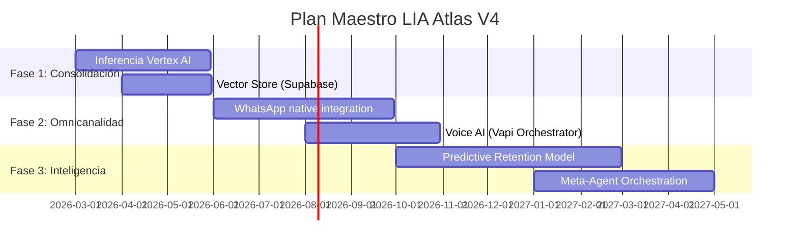
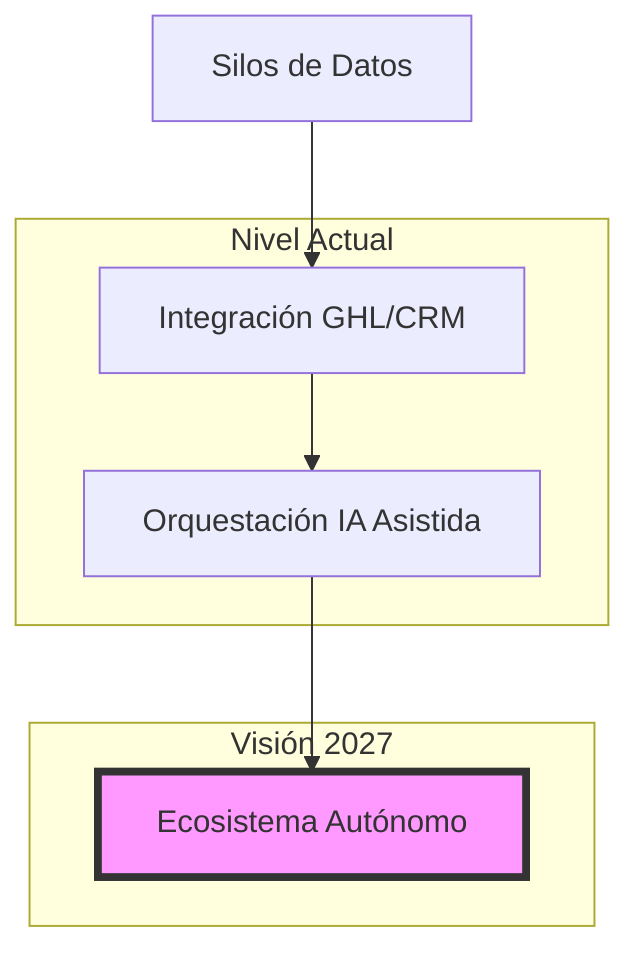
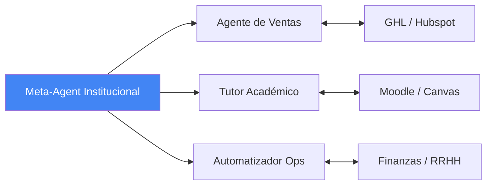
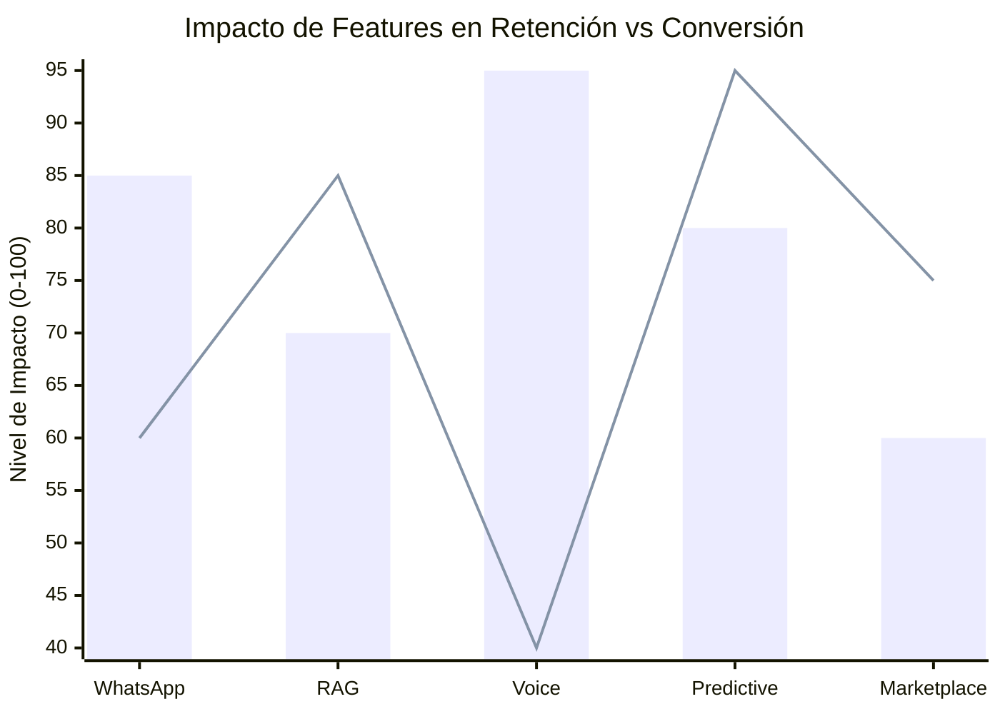

# 🗺️ 10: ROADMAP ESTRATÉGICO (ULTRA DETAIL V4)

## 🏔️ Capa de Visión (Evolución del Ecosistema)

LIA no es una herramienta estática; es un organismo en evolución. El Roadmap V4 proyecta la transición de una plataforma de "Agentes de Venta" a una "Red Neuronal Educativa" capaz de orquestar procesos operativos complejos de forma autónoma.

---

## 📅 Cronograma Maestro 2026-2027

Este Gantt detalla las tres fases críticas de la evolución tecnológica de LIA.

---

## 🧩 Curva de Madurez Técnica

Diagrama de cómo LIA escala desde la integración de datos hasta la autonomía de procesos.

---

## 🛠️ Stack Tecnológico en Evolución

| Capa | Implementación Actual | Evolución V4+ | Tecnología Sugerida |
| :--- | :--- | :--- | :--- |
| **Inferencia** | Gemini API / OpenAI | Vertex AI Enterprise | Google Cloud Vertex |
| **Grounding** | JSON-based Context | Vector Grounding (RAG) | Pinecone / pgvector |
| **Voz** | N/A | Voice Real-time Agent | Vapi / ElevenLabs |
| **Búsqueda** | SQL Simulado | Semantic Search | Meilisearch / Algolia |
| **Observability** | Console Logs | Prompt Auditing | LangSmith / Helicone |

---

## 🛸 Orquestación de Meta-Agentes (Ecosistema)

El futuro de LIA no es un solo agente, sino una red de especialistas coordinados por un "Institucional Meta-Agent".

---

## 📈 Impacto Académico-Comercial (Roadmap)

> [!NOTE]
> **Barras**: Impacto en Conversión (Sales).
> **Línea**: Impacto en Retención (Académica).

---

## 🔗 Navegación

- [Ir al Índice Maestro](./00_MASTER_INDEX.md)
- [Volver a Infraestructura (01)](./01_INFRAESTRUCTURA_Y_RED.md)
- [Auditoría Finalizada ✅](mailto:admin@lia.ai)

---
*LIA Atlas v15.4 - Proyectando el Futuro de la IA Educativa*
